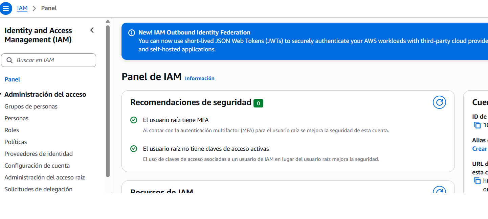
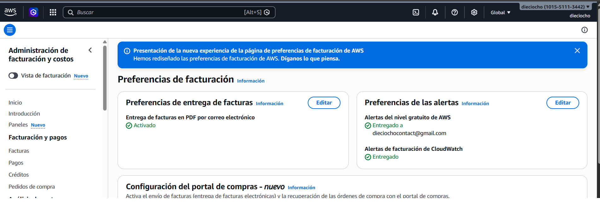
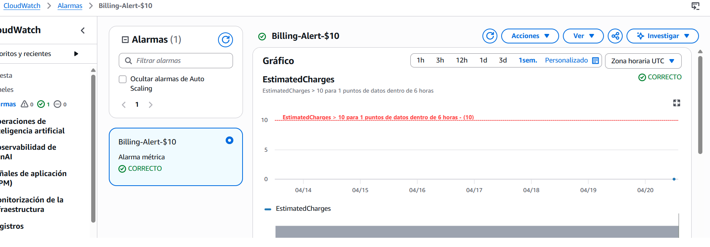
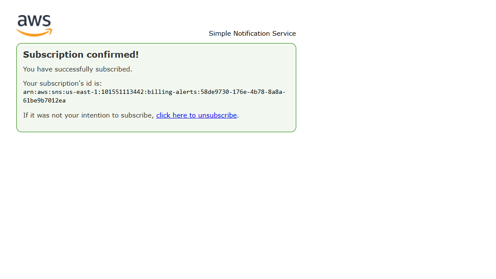
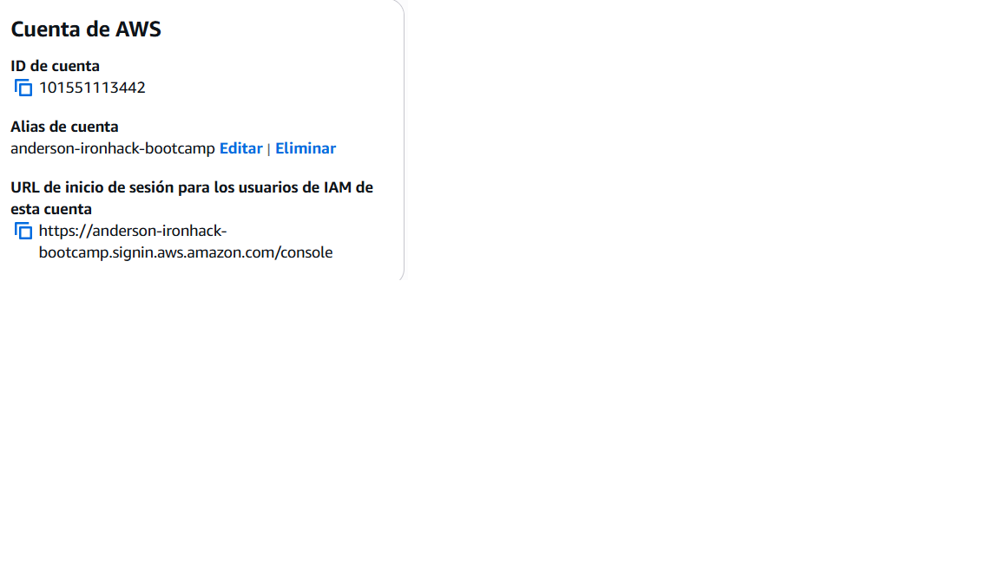
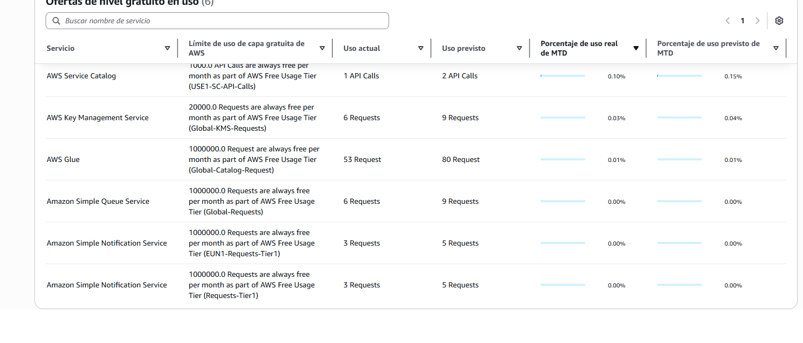

# AWS Account Setup Lab - Solution

**Student Name:** Anderson Fernandes 
**Date Completed:** 20/04/2026

---

## Exercise 1: MFA Configuration

### Screenshot:

### Notes:
- Authenticator app used: [Google Authenticator / Microsoft Authenticator / Authy]
- MFA setup completed successfully: Yes
- Backup codes saved: Yes

---

## Exercise 2: Billing Alerts

### Screenshots:

**Billing Preferences:**

**Billing Alarm:**

**SNS Confirmation:**

### Configuration Details:
- Alert threshold: $10
- Email confirmed: Yes
- Additional thresholds created (bonus): [Yes / No - if yes, list amounts]

---

## Exercise 3: Account Alias

### Screenshot:

### Account Details:
- **Account Alias:** anderson-ironhack-bootcamp
- **Sign-In URL:** `https://anderson-ironhack-bootcamp.signin.aws.amazon.com/console`
- **Tested successfully:** Yes

---

## Exercise 4: Free Tier Dashboard

### Screenshot:

### Current Free Tier Usage Summary:

| Service | Current Usage | Free Tier Limit | Status |
|---------|--------------|-----------------|--------|
| EC2 | [X hours / 750 hours] | 750 hours/month | Green |
| S3 | [X GB / 5 GB] | 5 GB | Green |
| AWS Service Catalog | 1 API Calls | 2 API Calls | Green |
| AWS Glue | 6 Requests | 9 Requests | Green |

### Notes:
- Any services approaching limits? No
- Any unexpected usage? No

---

## Exercise 5: Reflection Questions

### 1. Why is MFA important even for a personal learning account?

**Your Answer:**
Because even if a i am testing things, my AWS account is still linked to payment method. If someone has acces to my acout they can use a lot of resources and i can have surprieses in the billing.

---

### 2. What would happen if you left your root user unprotected?

**Your Answer:**
That someone can taje full control without limits and start expensive services only with my pasword.

---

### 3. How do billing alerts help prevent unexpected charges?

**Your Answer:**
Because in AWS you can keep running services generating costs unless you stop them and alerts help you to realise that. You get notified when you rech the budget you set. Proactive monitoring is important to have all in control to see if all is doing great.

---

### 4. What threshold did you set for your billing alert and why?

**Your Answer:**
Its low enough to warn you fast is something is not working correctly. For learning i think its aproppiate. Yes i would set more but i dont think its necessary for my usage.

---

### 5. What is your account alias and why did you choose it?

**Your Answer:**
- **Alias:** anderson-ironhack
- **Reasoning:** I choose that name becasue its easy to remember because my name is anderson and i am in the ironhack bootcamp.

---

### 6. What services are you currently using according to the Free Tier dashboard?

**Your Answer:**
AWS Service Catalog, AWS Key Management Service, AWS Glue, Amazon Simple Queue Service, Amazon Simple Notification Service, Amazon Simple Notification Service
No unexpected use

---

## Bonus Challenges Completed (Optional)

### Challenge 1: Multiple Billing Alert Thresholds

- [ ] $5 threshold
- [ ] $25 threshold
- [ ] $50 threshold

**Screenshots (if completed):**
[Add screenshots here]

---

### Challenge 2: CloudTrail Enabled

- [ ] CloudTrail enabled
- [ ] Logging to S3 configured

**Notes:**
[Add any notes about CloudTrail setup]

---

### Challenge 3: AWS Trusted Advisor Reviewed

- [ ] Accessed Trusted Advisor
- [ ] Reviewed recommendations

**Key recommendations found:**
[List any recommendations you found]

---

## Lessons Learned

**What was the most challenging part of this lab?**

[Your answer]

---

**What would you do differently next time?**

[Your answer]

---

**What security practices will you implement going forward?**

[Your answer]

---

## Checklist Before Submission

- [ ] All required screenshots captured and saved
- [ ] Screenshots are clear and show relevant information
- [ ] All reflection questions answered thoroughly
- [ ] Account alias documented
- [ ] Free Tier usage documented
- [ ] Work committed to Git
- [ ] Pull request created
- [ ] PR URL submitted to Student Portal

---

**Lab Completed By:** [Your Name]  
**Date:** [Date]
